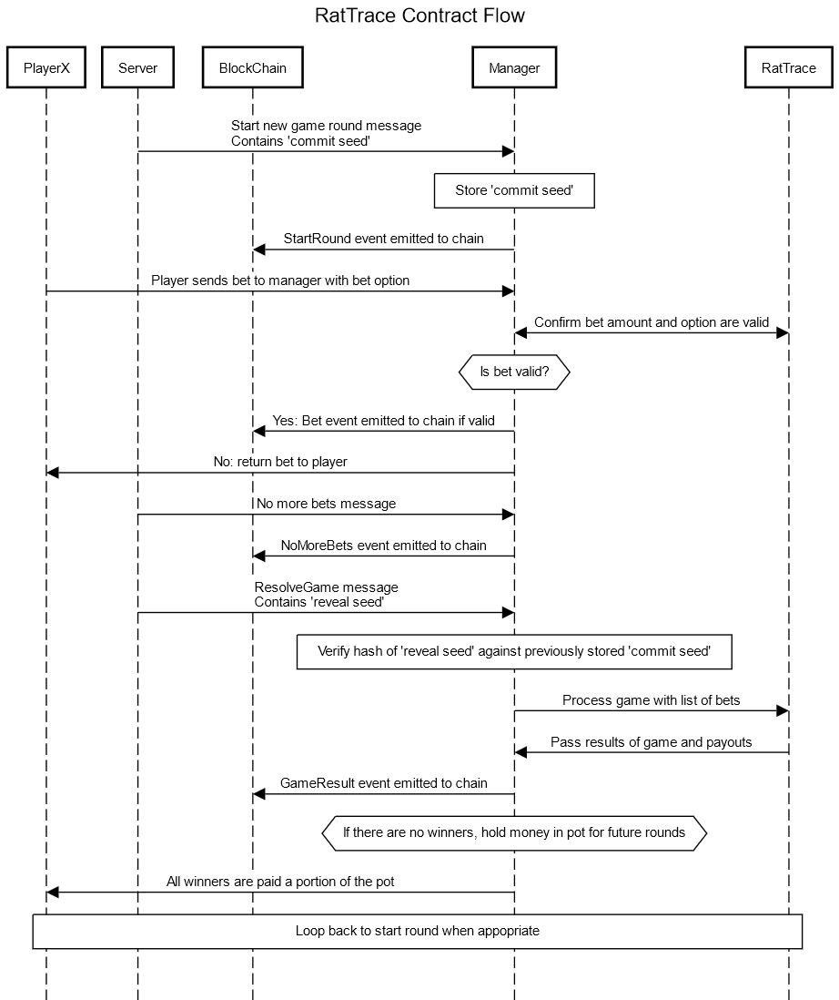

# Lab Rats: Eth Global Scaling Ethereum Hackathon

This is RatTrace, the lab rats scaling hackathon project.

A multiplayer trading simulation game running in real-time on the Optimism chain. Players try to predict where the price will go next by placing tokens on the graph. This proof of concept shows that all token transfers and game logic can be performed in on-chain without spending excessive ETH on gas costs without affecting game experience.

[Play](https://6093f7d4b3ec9e009d1913d2--lab-rats-scaling-ethereum.netlify.app/)

| What | Status |
| --- | :-- |
| Client |  |
| Contracts |  |
| Server |  |
| DB |  |

## Description

RatTrace is a simple multi-player graph trading game where players can bet against whether the price is going to go higher or lower.  

Games are started each by the server issuing a ``start game`` transaction, and when the players see the chain event for this they can place their bets by placing ``bet`` transactions. After a period of time the server issues a ``stop betting`` transaction followed by an ``resolve game`` transaction where the results of the game are reported in an event and displayed in the client.

Random numbers for the game are provided by a commit-reveal scheme.  The server generates a large random number 'Reveal Seed' and hashes that to produce the 'Commit seed '.  The commit seed is passed in the ``start game`` transaction, and the reveal seed passed in the ``resolve game`` transaction, and verified against the commit seed before it is used.

The server includes a faucet to issue test funds so that players can play without needing to go and get any from anywhere else.

## How its made

RatTrace was built iteratively with all parts being developed in parallel with the various components being built and deployed centrally using various continuous integration systems:

* Client Netifly
* Contracts - Github Actions
* Server - TeamCity and Octopus

### Contracts

There are several contracts that interact to implement the game.

* 'ERC667' token - the LABRATS token that bets on the game are made in
* 'Faucet' contract - for issuing the funds to players so they can play.
* 'MultiplayerGamesManager' - controls the game betting cycle
* 'RatTrace' game contract - the game logic

Contracts were built using hard hat for deployment and used ganache for the initial testing and development of the contracts.

#### Dependencies

* Hardhat
* Ganache

### Dapp Client

The client is made up of a web app hosting a game component.

The web app is built in React with a blank template and all view components were created and styled from scratch. We use the FunFair Wallet for authentication and web3 provider functionality and React Redux to manage state. Player count and game history are received through WebSockets which we connect to via signalR and there is an integrated HTTP faucet which we call using the javascript Fetch API. All other state is read from JSON-RPC logs via Ethers.js.  

The real-time WebGL game display has been built from scratch using our in-house game engine along with a minimal set of previously created assets to make a smooth graph display featuring lighting and effects with a 3D user interface.

#### Dependencies
* Funfair Wallet
* ethersjs
* React
* signalR
* Funfair game engine (FFEngine module) - Our in-house developed game engine which extends the popular THREE.js WebGL 3D renderer
* A small selection of previously made assets such as fonts and images in the ``client/public/game`` folder

### Server

The server is a service under systemd that communicates with the client, the blockchain and a MS SQL Server database.

This is built using C# using dotnet core 5 to provide a REST api and signalR endpoint to the client as well as some background services to maintain game state on the chain.  The relies on reading transaction event logs from the chain to change the internal server db view of the game and provide it though web socket events to the client.  Although these events are still sent to the client (as is useful for debugging purposes and also during initial development) the client now ignores most of these and reads the transaction event logs off the chain.

Server only starts games if there are players online and monitors the games in the database for when they need an action to occur on them (e.g. stop new bets from being accepted).

#### Dependencies
* Dotnet 5
* Funfair Ethereum Services (JSON-RPC/Web3 wrapper)
* Funfair Monitoring and Alerting libraries (for reporting low server balances)
* signalR
* Redis (as signalR backplane)
* Dapper (for SQL server integration)
* SQL Server
* Swashbuckle - for producing API swagger pages
* Serilog for logging
* FluentValidation.AspNetCorer - for REST API validation

